# 💻 C Programming Experiments – UPES

This repository contains all **C programming experiments** performed as part of the academic coursework at **UPES**.  
Each folder contains the source code along with the **correct output screenshots** for clarity and evaluation.

---

## 📚 Table of Contents

| Experiment No. | Title | Folder Link |
|----------------|--------|--------------|
| 1 | Basic Programs | [View Experiment 1](#experiment-1--basic-programs) |
| 2 | Area & Temperature Conversion | [View Experiment 2](#experiment-2--area--temperature-conversion) |
| 3.1 | Conditional & Logical Programs | [View Experiment 3.1](#experiment-31--conditional--logical-programs) |
| 3.2 | Loops & Patterns | [View Experiment 3.2](#experiment-32--loops--patterns) |
| 4 | Variables & Scope | [View Experiment 4](#experiment-4--variables--scope) |
| 5 | Decision Making & Lists | [View Experiment 5](#experiment-5--decision-making--lists) |

---

## 🧪 Experiment 1 – Basic Programs

| Program | Code | Output Screenshot |
|----------|------|-------------------|
| Address Printing | [address.c](Experiment1/address.c) | 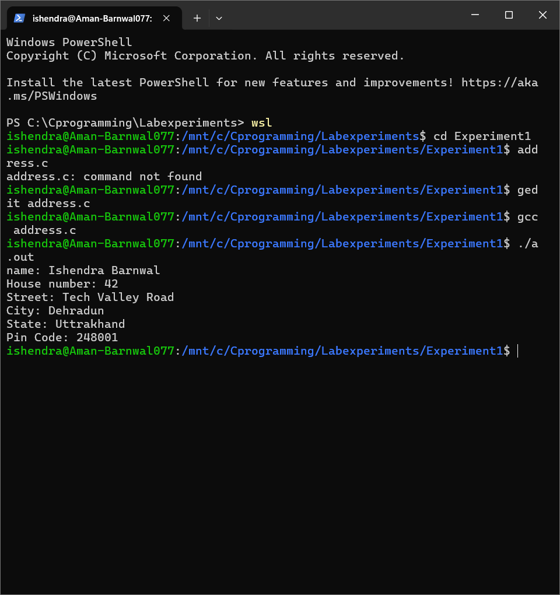 |
| Age Calculation | [age.c](Experiment1/age.c) | 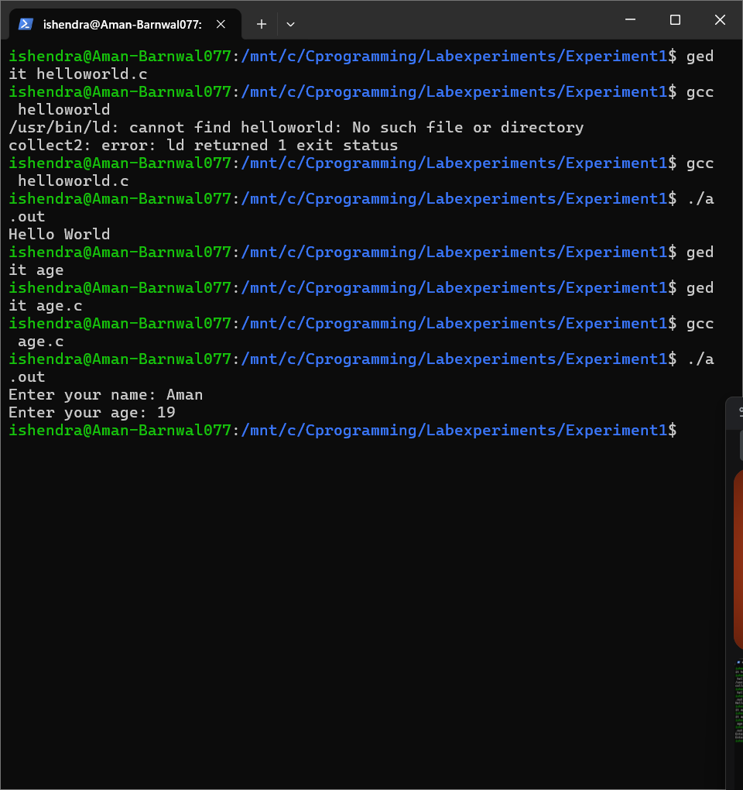 |
| Hello World | [helloworld.c](Experiment1/helloworld.c) | 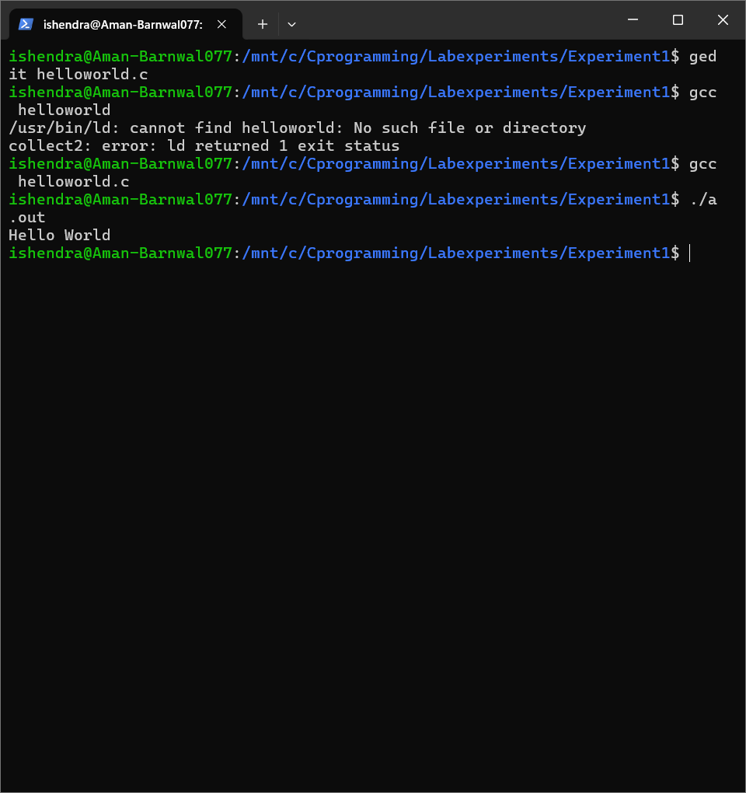 |
| Sum of Two Numbers | [sum.c](Experiment1/sum.c) | 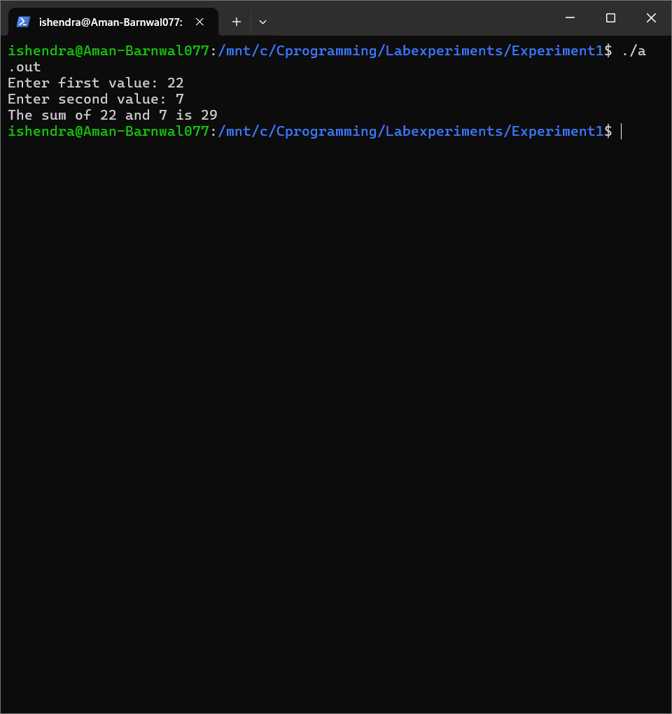 |

---

## 🧮 Experiment 2 – Area & Temperature Conversion

| Program | Code | Output Screenshot |
|----------|------|-------------------|
| Area and Perimeter | [areaandperimenter.c](Experiment2/areaandperimenter.c) |  |
| Celsius to Fahrenheit | [celsiustofahrenheit.c](Experiment2/celsiustofahrenheit.c) | 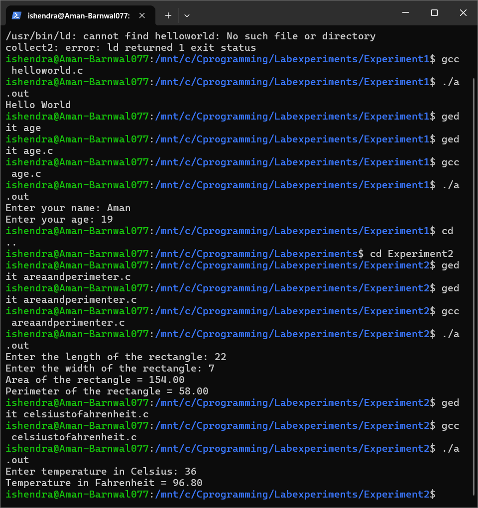 |

---

## ⚙️ Experiment 3.1 – Conditional & Logical Programs

| Program | Code | Output Screenshot |
|----------|------|-------------------|
| BMI Calculation | [bmi.c](Experiment3.1/bmi.c) |  |
| Check Collinearity | [collinear.c](Experiment3.1/collinear.c) |  |
| Gregorian Calendar | [Gregoriancalender.c](Experiment3.1/Gregoriancalender.c) |  |
| Ternary Operator | [ternaryoperator.c](Experiment3.1/ternaryoperator.c) |  |
| Triangle Validity | [triangles.c](Experiment3.1/triangles.c) |  |

---

## 🧩 Experiment 3.2 – Loops & Patterns

| Program | Code | Output Screenshot |
|----------|------|-------------------|
| Multiplication Table | [multiplicationtable.c](Experiment3.2/multiplicationtable.c) |  |
| Pattern 1 | [pattern.c](Experiment3.2/pattern.c) |  |
| Pattern 2 | [pattern2.c](Experiment3.2/pattern2.c) |  |
| Population Growth | [population.c](Experiment3.2/population.c) |  |
| Ramanujan Numbers | [ramanujan.c](Experiment3.2/ramanujan.c) |  |
| Sign of Integer | [signinteger.c](Experiment3.2/signinteger.c) |  |

---

## 🧠 Experiment 4 – Variables & Scope

| Program | Code | Output Screenshot |
|----------|------|-------------------|
| Variable Declaration | [declarevariables.c](Experiment4/declarevariables.c) |  |
| Local Blocks | [localblocks.c](Experiment4/localblocks.c) | 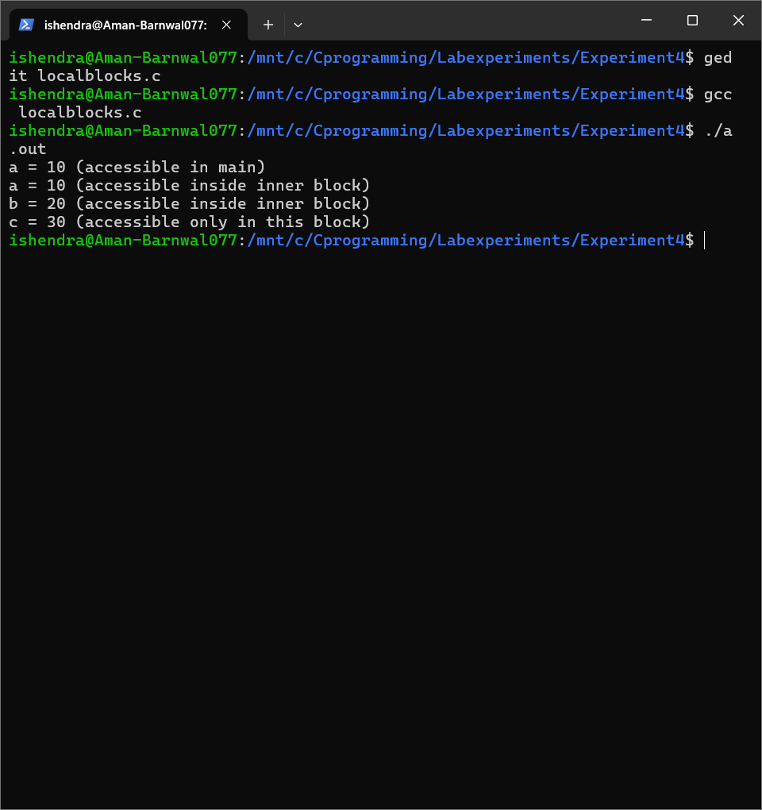 |
| Local Variable | [localvariable.c](Experiment4/localvariable.c) | 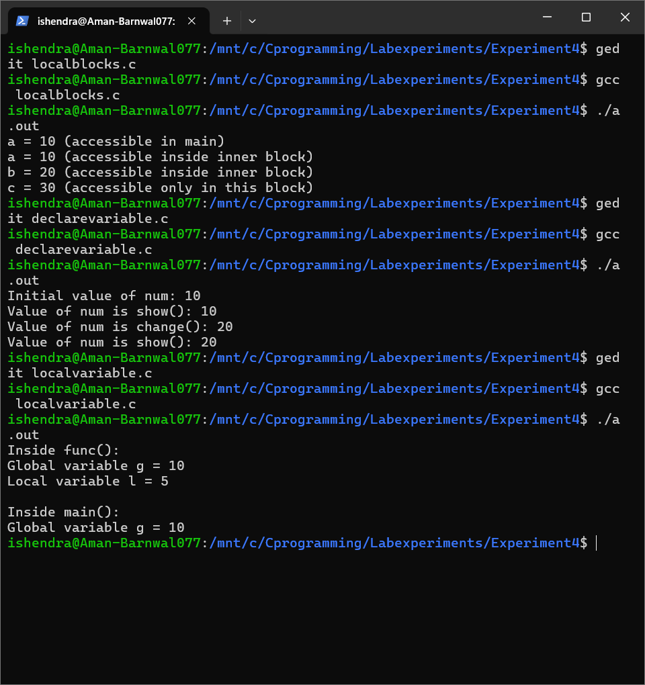 |

---

## 🔢 Experiment 5 – Decision Making & Lists

| Program | Code | Output Screenshot |
|----------|------|-------------------|
| Even Numbers | [even.c](Experiment5/even.c) | 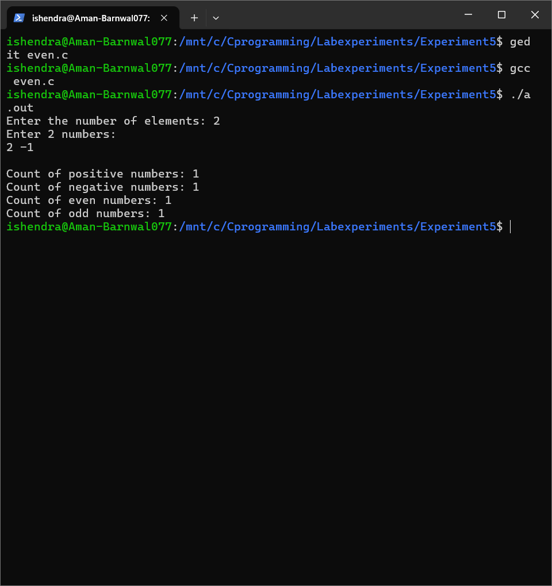 |
| List of Integers | [listofintegers.c](Experiment5/listofintegers.c) | 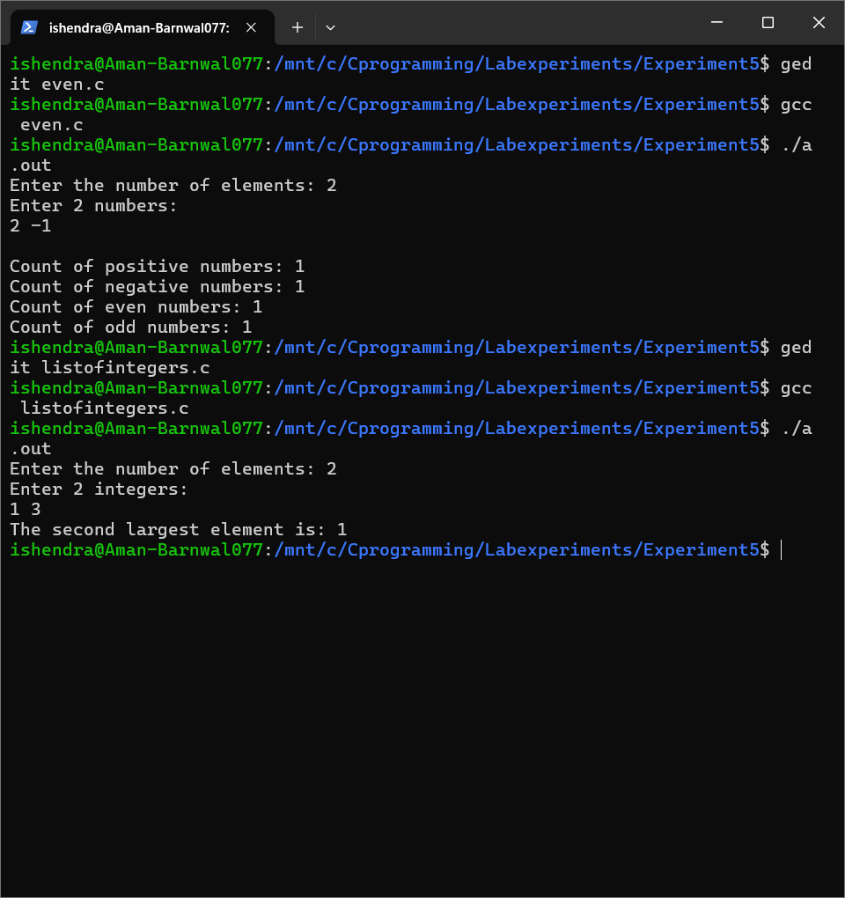 |
| List of Particular Number | [listofparticularnumber.c](Experiment5/listofparticularnumber.c) | 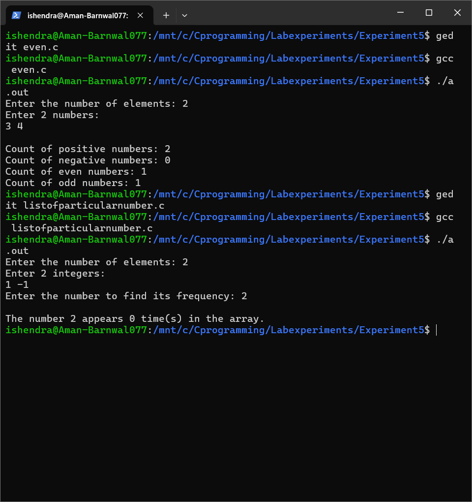 |
| Matrices | [matrices.c](Experiment5/matrices.c) | 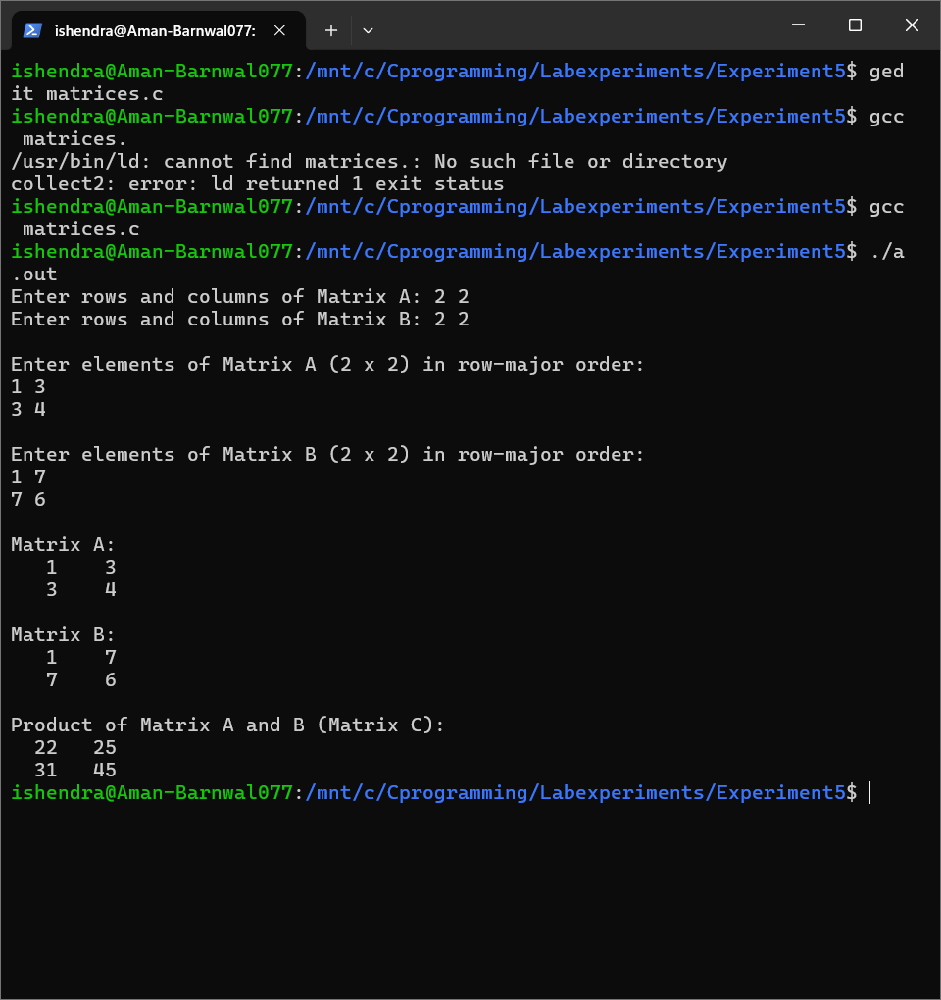 |

---

## 🧭 Notes
- All programs were compiled and executed successfully on a Linux-based environment using GCC.
- Each experiment folder contains both **source code** and **verified output screenshot**.
- This structure is maintained for clarity and easy faculty evaluation.

---

## ✍️ Author
**Aman Barnwal**  
UPES – C Programming Lab  
📧 [GitHub Profile](https://github.com/aman-barnwal)

